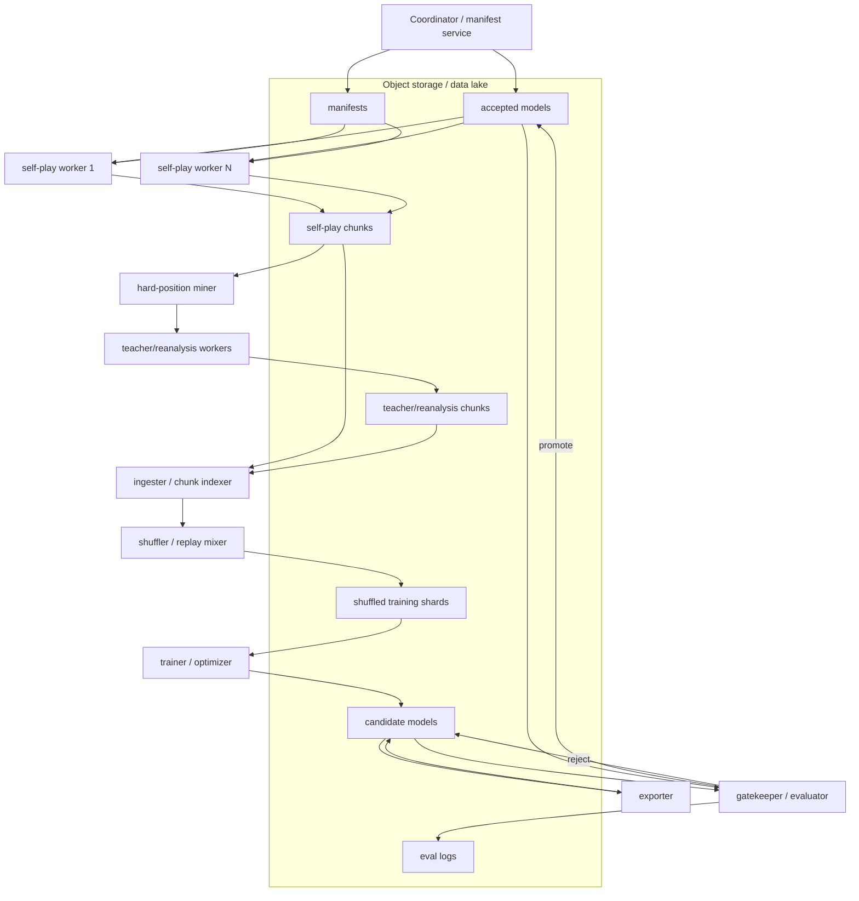

# Distributed Self-Play Training System Design for a Lightweight Neural Chess Engine

> **Status: Reference / future architecture.** This is a long-term distributed self-play and reanalysis design, not the immediate execution plan. Near-term use it for accepted/candidate model discipline, chunk schemas, WAL/atomic-write patterns, object-storage layout, and teacher-reanalysis worker design. Do **not** launch full distributed self-play until supervised/AV/search gates, UCI wrapping, and local promotion tests are stable.

**Purpose:** synthesize ideas from MiniZero, KataGo, and Leela Chess Zero's `lczero-training` into a practical system design for a custom SquareFormer / tiny-Leela-style neural chess engine.

**Target engine:** a lightweight neural chess engine with browser/WASM/WebGPU deployment constraints, but with an offline training system capable of distributed self-play, teacher reanalysis, promotion gates, action-value training, and eventual actor/student distillation.

---

## 0. Executive summary

The cleanest design is not to clone any one framework. Use:

```text
MiniZero for the conceptual topology:
  coordinator/server + self-play workers + optimization worker + data storage

KataGo for the operational loop:
  selfplay → shuffle → train → export → gatekeeper
  asynchronous workers, accepted-model directory, shared data lake, promotion gate

lczero-training for chess-specific data handling:
  chunk sources → shuffled chunk pool → optional rescorer → frames → tensor generator
  RL sliding windows vs SL full-dataset training
  rich policy/value/moves-left targets
```

For our project, the recommended architecture is:

```text
Object storage / data lake
  ├── accepted models
  ├── candidate models
  ├── self-play chunks
  ├── teacher-reanalysis chunks
  ├── shuffled training shards
  ├── eval/gatekeeper results
  └── manifests

Coordinator
  ├── publishes latest accepted model
  ├── schedules self-play jobs
  ├── monitors chunks and metrics
  ├── starts trainer cycles
  ├── triggers eval/promotion gates
  └── updates manifests

Self-play workers
  ├── pull latest model + config
  ├── run MCTS/PUCT games
  ├── write WAL after every move
  ├── upload completed compressed chunks
  └── exit safely if preempted

Trainer
  ├── builds replay mixture
  ├── samples recent self-play + hard positions + teacher labels
  ├── trains SquareFormer-AV-PUCT heads
  ├── exports candidate model
  └── logs static metrics

Gatekeeper / evaluator
  ├── candidate vs current best
  ├── fixed openings, fixed nodes/time
  ├── policy-only / AV / PUCT / conditional-search modes
  ├── tactical suites and calibration checks
  └── promote or reject
```

The guiding principle:

```text
Generate on-policy positions cheaply.
Use search and teachers to turn them into high-quality labels.
Train a small student to absorb those labels.
Promote only when evaluation proves improvement.
```

## 0.1 Current project fit

For the current `tiny_leela` phase, the safest interpretation is:

```text
Do now:
  accepted/candidate manifests
  chunk/schema validators
  WAL + atomic upload protocol
  teacher/reanalysis worker interface
  local gatekeeper discipline
  distributed cache/reanalysis jobs

Do later:
  full distributed self-play
  continuous asynchronous trainer
  actor/student split at scale
  pure self-play replay windows
```

Reason: current tiny models and AV heads are not yet calibrated enough to trust shallow self-play as the primary teacher.  Distributed teacher/cache/reanalysis is a better first cloud target than distributed self-play.

---

## 1. What each framework teaches us

## 1.1 MiniZero: clean distributed AlphaZero topology

MiniZero is a general AlphaZero/MuZero/Gumbel Zero framework. Its architecture is the cleanest abstraction for a training system:

```text
server
self-play workers
optimization worker
data storage
```

The MiniZero README says the server controls training, asks self-play workers to generate games with the latest network, collects game records, stops self-play when enough games are available, starts the optimization worker, and stores updated networks. It also notes that each self-play worker can maintain multiple MCTS instances and batch GPU inference across leaf evaluations.

### Borrow from MiniZero

```text
Coordinator as the owner of training state.
Many self-play workers producing games in parallel.
Many games/MCTS instances per self-play worker.
Batched NN leaf inference inside workers.
Trainer samples from replay buffer.
Network versions stored in shared storage.
Iteration-based bookkeeping.
Explicit train/eval config separation.
Evaluation/fight workers with stochastic exploration disabled.
```

### Do not copy blindly

```text
MiniZero is not chess-first.
It does not know our SquareFormer action-value heads.
It does not provide our browser deployment/eval requirements.
It assumes a more generic game-environment abstraction than we may want.
```

### Design adaptation

Use MiniZero's topology, but implement a chess-specific worker and data schema:

```text
SquareFormer model
PUCT/Gumbel-root engine
legal move map
WDL/value/action-value labels
hard-position mining
teacher reanalysis
browser deployment metrics
```

MiniZero-specific practices to copy early:

```text
env_test mode: random legal game -> serialize -> replay -> assert final state
resign_disable_ratio: sometimes ignore resignation to detect false resigns
root exploration config: Dirichlet, temperature schedule, optional Gumbel-root search
virtual loss / in-flight leaf protection for parallel searches
intermediate sequence/chunk output so long games do not grow unbounded memory
analysis dashboards for self-play returns, lengths, throughput, and optimization loss
```

---

## 1.2 KataGo: practical five-process production loop

KataGo's self-play loop is the most useful operational reference. Its `SelfplayTraining.md` describes five continuously running components:

```text
1. selfplay engine
2. shuffler
3. training
4. exporter
5. gatekeeper
```

KataGo supports both synchronous one-machine training and asynchronous multi-machine training. The asynchronous mode keeps all processes running continuously, with self-play producing data, the shuffler preparing training data, the trainer producing models, the exporter converting them for C++ use, and the gatekeeper accepting or rejecting new models.

KataGo also gives a very practical compute-ratio heuristic: spend roughly **4x to 40x more GPU power on self-play than on training**, because self-play/search is usually the bottleneck in AlphaZero-style systems.

### Borrow from KataGo

```text
Five logical processes:
  selfplay → shuffle → train → export → gatekeep

Accepted-model directory:
  self-play uses only accepted models.

Candidate-model directory:
  trainer exports new candidate models.

Gatekeeper:
  candidate must beat accepted baseline before it enters self-play.

Shuffler:
  self-play output is not trained directly; it is windowed, shuffled, and batched.

Asynchronous operation:
  each process can run forever and recover from restarts.

Safe writes:
  write temp files, then atomic rename.
```

### Extra KataGo ideas to adapt

KataGo's methods page lists general techniques such as shaped Dirichlet noise, root policy softmax temperature, policy surprise weighting, dynamic variance-scaled cPUCT, short-term value and score targets, uncertainty-weighted playouts, and auxiliary soft policy targets.

For chess, good analogues are:

```text
root exploration:
  temperature + Dirichlet/root noise early in games

policy surprise weighting:
  prioritize positions where search overturns policy

dynamic cPUCT:
  tune exploration based on uncertainty / value variance

short-term value:
  train after-reply / two-ply value heads

uncertainty-weighted search:
  spend extra nodes where model is unsure

soft policy:
  train both sharp search visit policy and softened policy distributions
```

### Do not copy blindly

```text
KataGo is Go-specific.
Some targets like territory/ownership do not map directly to chess.
Its C++/Python tooling is mature but not minimal.
```

### Design adaptation

Use the five-process architecture, but replace Go-specific targets with:

```text
policy visits
WDL / value buckets
moves-left or horizon
action-value Q per candidate
reply policy / PV
uncertainty / search-error labels
tactical flags
```

---

## 1.3 lczero-training: chess-specific data loader and training tensor ideas

`lczero-training` is the strongest reference for chess-specific training data flow. The current docs describe a newer pipeline in `src/` and `csrc/` with a C++ data loader exposed to Python. It supports training data as `.tar` or `.gz` chunk sources, watches directories for new files, and distinguishes **chunk/game**, **chunk source**, **frame/record/position**, and **training tensor**.

The documented data-loader stages include:

```text
file_path_provider
chunk_source_reader / loader
chunk_source_splitter
shuffling_chunk_pool
chunk_rescorer
chunk_unpacker
shuffling_frame_sampler
tensor_generator
```

The docs also explicitly distinguish RL and SL modes:

```text
RL:
  smaller sliding chunk window
  wait for chunks_per_network new chunks
  current hanse sampling path

SL:
  chunk pool larger than all data
  chunks_per_network = 0
  two-stage sampling with frame sampler
```

The current batch format is documented as:

```text
inputs:        [batch_size, 112, 8, 8]
policy_target: [batch_size, 1862]
value_target:  [batch_size, 6, 3]
```

where value rows include sources such as result, best, played, orig, root, and st, and columns include q, draw, and moves-left.

### Borrow from lczero-training

```text
Chunk-oriented data lake.
Training positions are frames extracted from game chunks.
Sliding replay window for RL.
Full-data replay for SL.
Optional rescorer for tablebase/teacher corrections.
Reservoir / shuffled frame sampling.
Tensor generator isolated from source chunk format.
Multiple value target sources, not only final result.
```

### Do not copy blindly

```text
Its policy vector and chunk format are lc0-specific.
The new pipeline is active-development code.
Your SquareFormer from-to/action-value heads need richer labels than classic lc0 tensors.
```

### Design adaptation

Keep the staged-loader idea, but define your own chunk schema that supports:

```text
from-to legal move representation
policy visits over legal moves
search Q per move
WDL/root value
action-value labels
reply/PV labels
uncertainty labels
teacher provenance
browser/deployment metadata
```

---

# 2. Recommended system architecture

## 2.1 High-level diagram



## 2.2 Component responsibilities

## Coordinator

The coordinator owns run state.

Responsibilities:

```text
publish latest accepted model
publish self-play config
publish training config
record model lineage
track chunk counts
track worker health
schedule or trigger trainer cycles
trigger eval gates
promote/reject candidates
write manifests
```

Minimum implementation:

```text
a JSON manifest in object storage
+ a simple CLI
+ optional FastAPI dashboard later
```

Do not start with Kubernetes unless you already need it.

---

## Self-play workers

Workers are stateless except for local WAL files.

Responsibilities:

```text
pull latest accepted model
pull search config and opening seeds
play games using SquareFormer + PUCT/search-light engine
record move-level search statistics
write a WAL after every move
flush complete games into compressed chunks
upload chunks atomically
resume or discard safely if interrupted
```

Worker design principle:

```text
Any worker can die at any time without corrupting the data lake.
```

Recommended worker loop:

```python
while True:
    manifest = fetch_latest_manifest()
    model = ensure_model(manifest.accepted_model)
    config = ensure_config(manifest.selfplay_config)

    game = start_game(opening_seed=config.next_seed())
    wal = open_wal(game.id)

    while not game.done:
        search = run_search(model, game.position, config)
        move = select_move(search, config.temperature_schedule)

        wal.append({
            "fen": game.position.fen(),
            "legal_moves": game.legal_moves(),
            "raw_policy": search.raw_policy_topk,
            "visits": search.visit_counts,
            "q": search.q_values,
            "root_wdl": search.root_wdl,
            "pv": search.pv,
            "selected_move": move,
            "nodes": search.nodes,
            "rng_seed": game.rng_seed,
            "net_id": model.id,
            "net_sha256": model.sha256,
            "model_iteration": model.iteration,
            "config_hash": config.hash,
            "search_config_id": config.search_config_id,
            "root_exploration": config.root_exploration,
            "resign_disabled": game.resign_disabled,
        })

        game.play(move)

    wal.append_result(game.result)
    chunk = finalize_chunk(wal)
    upload_atomic(chunk)
```

---

## Ingest / chunk indexer

Responsibilities:

```text
watch for new chunks
validate chunk checksum/schema
index metadata
reject corrupt chunks
extract per-position frames
route validation/test split if needed
```

Borrow from lczero-training:

```text
file_path_provider
chunk source reader
chunk shuffler
chunk unpacker
tensor generator
```

Adaptation:

```text
object storage list/watch instead of local filesystem only
schema validation for SquareFormer labels
teacher provenance tracking
```

---

## Shuffler / replay mixer

The shuffler should convert raw chunks into model-ready training shards.

Inputs:

```text
recent self-play chunks
older accepted self-play chunks
teacher-reanalysis chunks
tablebase/endgame chunks
puzzle/tactical chunks
human/Maia chunks if used
```

Outputs:

```text
npz / parquet / webdataset / zstd JSONL shards
ready for trainer
```

Replay mixture:

```text
50% recent accepted-net self-play
20% hard mined positions
10% teacher reanalysis positions
10% tablebase/endgame curriculum
10% opening/puzzle/tactical curated data
```

This is just a starting point. Tune based on overfitting, value drift, and tactical regression.

Borrow from KataGo:

```text
training window grows over time
cap max training per new data
avoid repeating same shuffled files too often
use scratch disk for shuffling
atomic directory publish
```

Borrow from lczero-training:

```text
RL uses sliding chunk window
SL uses full dataset / large chunk pool
secondary frame sampler for good mixing
```

---

## Trainer

The trainer owns SGD/JAX/PyTorch updates.

Responsibilities:

```text
load latest accepted or selected checkpoint
load shuffled shards
train policy/WDL/value/action-value/aux heads
track static metrics
export candidate checkpoints
save optimizer state
publish tensorboard/wandb logs
```

Recommended losses:

```text
L =
  1.00 * KL(policy_search_or_teacher || policy_model)
+ 1.00 * CE(WDL_target, WDL_model)
+ 0.50 * CE(value_bucket_target, q_bucket_model)
+ 0.50 * CE(action_value_bucket, action_value_head)
+ 0.25 * pairwise_ranking_loss(candidate_moves)
+ 0.25 * CE(reply_policy_target, reply_head)
+ 0.10 * uncertainty_calibration_loss
+ regularization
```

For small models, keep auxiliary weights modest. The goal is representation shaping, not making brittle PV memorization dominate.

---

## Exporter

Responsibilities:

```text
convert training checkpoint to inference format
produce model metadata
run parity tests
publish candidate artifact
```

Artifacts:

```text
model.pt / orbax / ckpt
model.onnx.fp32
model.onnx.fp16
model.onnx.int8 if available
model manifest JSON
move-map/version file
tokenizer/feature-schema version
search config compatibility
```

Required parity tests before gatekeeping:

```text
training backend vs ONNX CPU
ONNX CPU vs WebGPU
legal policy top-k parity
WDL difference tolerance
action-value ranking tolerance
```

---

## Gatekeeper / evaluator

The gatekeeper decides whether a candidate can become the accepted model.

Responsibilities:

```text
candidate vs current best matches
fixed openings and reversed colors
fixed node/time budgets
policy-only, AV-rerank, PUCT, and conditional-search modes
tactical regression suites
calibration checks
latency checks
promote/reject/archive
```

Borrow from KataGo:

```text
candidate models do not automatically feed self-play unless accepted
gatekeeper can be disabled early for speed, but is valuable for debugging
```

Borrow from OpenBench/Fishtest conceptually:

```text
SPRT / fixed-game tests
protocol-relative Elo
fixed opening suites
error bars
```

Minimal gate:

```text
quick gate:
  400-1000 games vs current best
  fixed nodes
  broad opening suite
  plus tactical/reliability suite

serious gate:
  5000+ games
  multiple search modes
  browser latency check
```

Promotion criteria should be multi-metric:

```text
candidate must not regress:
  illegal move rate
  move-map parity
  queen/tactical suite
  WDL calibration
  browser inference parity

candidate should improve at least one:
  policy-only Elo
  AV-rerank Elo
  PUCT Elo
  conditional-search Elo
  regret/catastrophic blunder rate
```

---

## Teacher / reanalysis workers

These workers are optional initially but become central later.

Responsibilities:

```text
consume hard-position queue
run Stockfish/lc0/tablebase/student-deep-search
produce richer labels
upload teacher chunks
```

Teacher routing:

```text
piece_count <= 7:
  tablebase

tactical/check-heavy/material swing:
  Stockfish

quiet/strategic/high policy entropy:
  lc0

positions from our own PUCT:
  self-play search teacher

human/personality mode:
  Maia/human model
```

Hard-position mining criteria:

```text
policy/search disagreement
high policy entropy
high uncertainty
large search value swing
high regret selected move
queen/material/tactical blunder
evaluation-game losses
failed puzzle positions
rare endgames
```

---

# 3. Data schema

## 3.1 Game-level chunk

A chunk should represent one game or a small batch of games.

```json
{
  "schema_version": "sqf-sp-v1",
  "run_id": "run_0007",
  "chunk_id": "worker17_000123",
  "worker_id": "worker17",
  "net_id": "sqf_128x6_0042",
  "net_sha256": "...",
  "search_config_id": "puct64_v3",
  "config_hash": "...",
  "model_iteration": 42,
  "created_at": "2026-05-09T00:00:00Z",
  "game": {
    "initial_fen": "startpos",
    "opening_id": "uho_00123",
    "rng_seed": 123456,
    "result": "1-0",
    "termination": "checkmate",
    "plies": 91
  },
  "positions": [
    {
      "ply": 0,
      "fen": "...",
      "side_to_move": "w",
      "legal_moves": ["e2e4", "d2d4"],
      "raw_policy_topk": [["e2e4", 0.21], ["d2d4", 0.18]],
      "search_visits": [["e2e4", 512], ["d2d4", 301]],
      "search_q": [["e2e4", 0.14], ["d2d4", 0.09]],
      "root_wdl": [0.38, 0.42, 0.20],
      "selected_move": "e2e4",
      "pv": ["e2e4", "c7c5", "g1f3"],
      "policy_entropy": 2.31,
      "uncertainty": 0.42,
      "nodes": 512,
      "temperature": 1.0,
      "root_exploration": {"kind": "dirichlet", "alpha": 0.3, "weight": 0.25},
      "gumbel_root": {"enabled": false, "top_k": 0, "sequential_halving": false},
      "resign_disabled": false,
      "resign_threshold": -0.9
    }
  ]
}
```

## 3.2 Position/frame record

Training should operate on frames extracted from chunks.

Minimum frame:

```json
{
  "fen": "...",
  "features_version": "sqf112_v3",
  "legal_moves": ["..."],
  "policy_target": [["move", prob]],
  "wdl_target": [w, d, l],
  "q_target": 0.0,
  "moves_left_target": 45.0,
  "source": "selfplay"
}
```

Recommended rich frame:

```json
{
  "fen": "...",
  "legal_moves": ["..."],

  "policy_targets": {
    "search_visits": [["e2e4", 0.55], ["d2d4", 0.32]],
    "teacher_policy": [["e2e4", 0.61], ["g1f3", 0.20]],
    "soft_policy": [["e2e4", 0.38], ["d2d4", 0.25]]
  },

  "value_targets": {
    "game_result_wdl": [1.0, 0.0, 0.0],
    "root_wdl": [0.61, 0.25, 0.14],
    "teacher_wdl": [0.64, 0.22, 0.14],
    "q": 0.50,
    "draw": 0.22,
    "moves_left": 42.0
  },

  "candidate_moves": [
    {
      "move": "e2e4",
      "kind": ["teacher_topk", "search_topk"],
      "q": 0.14,
      "wdl_after_move": [0.60, 0.25, 0.15],
      "best_reply": "c7c5",
      "after_reply_wdl": [0.55, 0.28, 0.17],
      "regret": 0.00,
      "pv": ["e2e4", "c7c5", "g1f3"]
    },
    {
      "move": "d1h5",
      "kind": ["student_topk", "hard_negative"],
      "q": -0.72,
      "best_reply": "g7g6",
      "after_reply_wdl": [0.05, 0.10, 0.85],
      "regret": 0.86,
      "flags": ["queen_risk", "refuted"]
    }
  ],

  "metadata": {
    "teacher": ["selfplay_puct", "stockfish"],
    "nodes": 128,
    "depth": 18,
    "source_game_id": "...",
    "hard_mined": true,
    "created_at": "..."
  }
}
```

## 3.3 Why store rich data early?

Even if V1 trains only policy/WDL, storing rich data lets later models train:

```text
action-value
reply policy
two-ply value
PV-lite
uncertainty
regret/ranking
tactical labels
```

without regenerating self-play.

## 3.4 Production encoding note

The JSON schemas above are reference/debug formats.  At scale, use compact shard formats and store stable IDs rather than repeated strings:

```text
manifest.json for provenance/schema
jsonl.zst for small/debug chunks
npz/msgpack/parquet/webdataset for large training shards
action_id arrays instead of repeated UCI strings when possible
sparse top-k policy/AV arrays instead of dense maps
```

Keep an easy-to-inspect JSON path, but do not make JSON parsing the high-throughput training bottleneck.

## 3.5 Mandatory perspective/version conventions

Every chunk/frame must make these conventions explicit:

```text
move_map_version
feature_schema_version
history_plies
policy_size
action_id_encoding
model_kind
search_config_id
git_commit
value_perspective: side_to_move | root_player | white
q_perspective for per-move action values
after_move / after_reply perspective rules
```

Chess training silently fails when WDL/Q/action-value perspective is inconsistent.  This is especially important for candidate-move AV heads, after-reply labels, mirrored positions, and side-to-move flipping.

---

# 4. Storage layout

Use object storage if distributed across cloud providers. Use local/NFS only for one-machine or same-cluster experiments.

Recommended layout:

```text
s3://tiny-leela-run/
  manifests/
    latest.json
    run_config.json
    accepted_model.json

  models/
    accepted/
      sqf_000042/
        model.onnx.fp16
        model.pt
        manifest.json
    candidates/
      sqf_000043/
        model.onnx.fp16
        model.pt
        manifest.json
    rejected/
      ...

  selfplay/
    net_sqf_000042/
      worker_017/
        gamechunk_000001.jsonl.zst
        gamechunk_000002.jsonl.zst

  wal/
    worker_017/
      active_game_abc123.wal.zst

  teacher/
    stockfish/
    lc0/
    tablebase/
    student_deep_puct/

  shuffled/
    2026-05-09T001200Z/
      train-00000.npz
      train-00001.npz
      val-00000.npz
      manifest.json

  evals/
    sqf_000043_vs_sqf_000042/
      games.pgn.zst
      results.json
      openings.json
      logs.txt

  metrics/
    tensorboard/
    static_eval/
    browser_latency/
```

Atomic write rule:

```text
write to .tmp
upload/flush completely
write checksum
rename/move to final key
```

In object storage, emulate atomicity with:

```text
upload content
upload manifest/checksum last
ingester only reads chunks with valid manifest/checksum
```

---

# 5. Training loop modes

## 5.1 Synchronous debug loop

Use this first on one machine.

```text
gatekeeper current candidates
self-play N games
shuffle/ingest
train for K samples
export candidate
evaluate
repeat
```

KataGo's synchronous script does this for setup/debugging. It is not optimal, but it is ideal for proving the loop.

Suggested tiny parameters:

```text
games_per_cycle: 200-1000
nodes_per_move: 32-64
batch_size: 512-2048
train_samples_per_cycle: 100k-500k
max_train_per_data: 2-8
gatekeeper: optional early, enabled once stable
```

## 5.2 Asynchronous production loop

After the synchronous loop works:

```text
self-play workers run continuously
shuffler/ingester runs continuously
trainer runs continuously or in epochs
exporter publishes candidates
gatekeeper promotes/rejects
```

Recommended compute balance:

```text
self-play GPU budget >> trainer GPU budget
start around 4x self-play:training
increase toward 10x+ if trainer waits for data less often
```

KataGo suggests 4x to 40x more GPU power on self-play than training, and that is a good planning prior.

## 5.3 Mixed supervised + RL loop

For your project, do not go pure RL immediately.

```text
Phase A:
  static supervised / teacher distillation

Phase B:
  shallow self-play with accepted model

Phase C:
  hard-position mining + teacher reanalysis

Phase D:
  actor/student split
```

Replay mixture example:

```text
40% recent self-play
20% historical accepted self-play
20% teacher-reanalyzed hard positions
10% tablebase/endgame
10% curated tactics/openings/human/Maia
```

---

# 6. Search and exploration policy

## 6.1 Self-play search modes

Start simple:

```text
early self-play:
  PUCT 32-64 nodes
  temperature high in opening, lower later
  random opening starts

mature self-play:
  PUCT 128-512 nodes on hard positions
  conditional compute via uncertainty
  deeper reanalysis on mined positions
```

## 6.2 Root exploration

Use exploration to avoid self-play collapse:

```text
temperature schedule
root noise / Dirichlet-like noise
opening randomization
UHO or curated start positions
safe candidate sampling
```

Suggested schedule:

```text
opening plies 0-12:
  sample from visit distribution, temperature 1.0

middlegame:
  temperature 0.5 or visit-count softmax

late/endgame:
  argmax visits unless generating exploration data
```

## 6.3 Targeted starts

Do not start all games from the initial position.

Use:

```text
random opening suites
known tactical motifs
imbalanced material positions
endgame tablebase positions
model failure positions
high teacher-disagreement positions
high policy-entropy positions
```

This avoids wasting data on familiar early openings.

---

# 7. Model/training target design

## 7.1 Model interface

Your self-play actor must expose the AlphaZero interface:

```text
fθ(position) →
  policy over legal moves
  WDL/value
```

Your stronger engine can add:

```text
action-value head
q/value bucket head
uncertainty head
reply/PV auxiliary heads
moves-left/horizon head
```

## 7.2 Training targets

Core:

```text
policy_target:
  search visit distribution or teacher policy

WDL/value_target:
  game result, root WDL, teacher WDL, tablebase

q/value_bucket_target:
  scalar or categorical value

action_value_target:
  per-candidate search Q / teacher value

uncertainty_target:
  value error, policy-search disagreement, teacher disagreement

reply/PV targets:
  opponent best reply, short PV, two-ply value
```

## 7.3 Candidate move set for action-value

Do not label only teacher top-k. Include the student's own moves.

```text
teacher top-k
student policy top-k
PUCT top-k
checks/captures/promotions
played move
random legal distractors
hard negatives
sound tactical positives
```

This is essential because the model's bad moves may not appear in teacher top-k.

---

# 8. Replay buffer and sampling

## 8.1 Sliding RL window

For self-play:

```text
recent chunks matter most
old chunks prevent forgetting
hard chunks are oversampled
```

Window sizing:

```text
small experiment:
  100k-1M positions

serious run:
  millions to tens/hundreds of millions of positions

lczero-training reference:
  RL chunk_pool_size typical values 250k to 5M chunks
```

Use positions, not only games, as your effective data budget.

## 8.2 SL vs RL sampling

Borrow from lczero-training:

```text
SL:
  use full dataset
  shuffle chunks then frames
  repeat epochs immediately

RL:
  use sliding chunk window
  wait for enough new chunks before training
  avoid overtraining on stale/current data
```

## 8.3 Prevent replay poison

Keep guardrails:

```text
teacher anchors
tablebase exact endgames
opening diversity
historical accepted-model data
hard-negative replay
evaluation loss positions
```

Do not train only on the newest self-play if it is unstable.

---

# 9. Evaluation and promotion

## 9.1 Gatekeeper tests

Use candidate vs accepted best.

Modes:

```text
policy-only
AV-top8
PUCT32
PUCT64
PUCT128
conditional-search
```

Metrics:

```text
WDL
Elo ± error
illegal moves
crashes
average latency
fixed-node strength
puzzle/tactical suite
WDL calibration
regret/catastrophic blunder rate
```

## 9.2 Promotion policy

Possible simple gate:

```text
promote if:
  candidate wins by positive Elo margin in main mode
  AND no tactical/regression failure
  AND no latency/export regression beyond threshold
```

Possible nuanced gate:

```text
promote to self-play actor if:
  PUCT64/PUCT128 improves

promote to browser release if:
  conditional-search utility improves

archive as teacher actor if:
  too slow for deployment but stronger for generating labels
```

## 9.3 Keep actor and deployed student separate

Do not require the self-play actor to be the deployed model.

```text
actor:
  larger model
  deeper search
  higher quality labels

student:
  smaller model
  action-value distillation
  WebGPU/WASM deployment
```

This is likely the best way to maximize lightweight strength.

---

# 10. Fault tolerance and preemptible cloud

## 10.1 WAL per game

Write after every move:

```text
fen
move
legal moves
raw policy
visit counts
Q values
WDL
PV
rng seed
net id
net/model hash
model iteration
config hash
search config
root exploration config
resign threshold / resign-disabled flag
```

If a worker dies:

```text
resume from last complete ply
or upload partial with "incomplete" flag
or discard with accounting
```

Do not silently discard all interrupted games without measuring it; that can bias toward short/easy games.

## 10.2 Idempotent uploads

Every chunk should have:

```text
chunk_id
worker_id
net_id
sha256
num_games
num_positions
schema_version
complete flag
```

Ingester should be idempotent:

```text
same chunk uploaded twice → one accepted record
corrupt chunk → quarantine
unknown schema → reject
```

## 10.3 Worker leases

Optional coordinator feature:

```text
worker requests lease for model/config
lease expires if worker silent
metrics heartbeat every N minutes
chunks accepted even if lease expired, but marked
```

Start without this if object-storage manifests are enough.

---

# 11. Minimal implementation plan

The first implementation should de-risk data and evaluation before generating large volumes of self-play.  Use this safer order.

## Phase 0: local chunk schema + validator

Deliverables:

```text
chunk/frame schema
schema validator
checksum/manifest convention
perspective/version convention tests
local directory layout
```

Target:

```text
small hand-written and generated chunks validate, roundtrip, and reject corrupt/perspective-mismatched data
```

## Phase 1: teacher/reanalysis chunk workers

Deliverables:

```text
hard-position input queue
Stockfish/lc0/tablebase worker interface
teacher chunk writer
atomic upload/checksum protocol
idempotent ingester
```

Target:

```text
cheap local/cloud workers can generate valid reanalysis chunks without risking self-play data collapse
```

## Phase 2: local accepted/candidate gatekeeper

Deliverables:

```text
accepted_model.json
candidate model manifest
candidate-vs-accepted eval
fixed openings/nodes
promotion/reject manifest
```

Target:

```text
only explicitly accepted models are eligible to generate future data
```

## Phase 3: local self-play loop

Deliverables:

```text
self-play executable
WAL per game
chunk finalizer
shuffler/replay mixer
trainer/exporter hookup
gatekeeper integration
```

Target:

```text
model improves over 3-5 local iterations on a tiny benchmark without illegal moves or value/perspective drift
```

## Phase 4: object-storage distributed cache/reanalysis

Deliverables:

```text
S3/R2/B2 bucket layout
manifest files
atomic upload protocol
worker CLI/Docker image
metrics logs
stateless job mode
```

Target:

```text
multiple workers upload validated teacher/cache/reanalysis chunks without conflicts
```

## Phase 5: distributed self-play workers

Deliverables:

```text
self-play worker CLI/Docker image
WAL/resume
opening seed assignment
accepted-model pull only
heartbeat/metrics
```

Target:

```text
cheap cloud workers generate valid self-play chunks from accepted models only
```

## Phase 6: replay mixer + richer labels

Deliverables:

```text
replay mix config
teacher chunks
hard-position mining
action-value candidate labels
SL/RL sampling modes
```

Target:

```text
AV/ranking/search metrics improve over policy-only without tactical or latency regression
```

## Phase 7: deployment loop

Deliverables:

```text
ONNX FP16 export
INT8/QAT experiments
browser parity test
latency/Elo frontier
actor/student split
```

Target:

```text
accepted training/actor models can produce deployable browser students
```

---

# 12. Recommended build-vs-adopt decision

## Adopt directly

```text
OpenBench-style evaluation concepts
KataGo-style five-process loop
MiniZero-style coordinator/worker/trainer abstraction
lczero-training-style staged loader and replay windows
```

## Build custom

```text
SquareFormer model/trainer
from-to policy map
action-value labels
WDL/value/action-value/uncertainty tensor format
browser export and parity tests
self-play chunk schema
object-storage manifests
hard-position reanalysis routing
```

## Avoid initially

```text
full lc0 chunk compatibility
full KataGo code fork
full MiniZero game integration
Kubernetes-heavy orchestration
custom distributed SGD
complex semantic memory / TurboQuant storage
```

---

# 13. Suggested config skeleton

```yaml
run:
  name: sqf_selfplay_001
  storage_uri: s3://tiny-leela/sqf_selfplay_001

model:
  arch: squareformer_av
  d_model: 128
  layers: 6
  heads: 4
  input_features: sqf112_v3
  heads_enabled:
    policy: true
    wdl: true
    value_bucket: true
    action_value: true
    uncertainty: true
    reply_policy: false

selfplay:
  accepted_model_manifest: manifests/accepted_model.json
  games_per_worker_batch: 32
  nodes_per_move: 64
  max_game_plies: 300
  opening_source: openings/uho_lite.epd
  temperature:
    opening_plies: 12
    opening_temp: 1.0
    midgame_temp: 0.5
    endgame_temp: 0.0
  root_noise:
    enabled: true
    alpha: 0.3
    weight: 0.25
  gumbel_root:
    enabled: false
    top_k: 16
    sequential_halving: true
  resign:
    enabled: false
    threshold: -0.9
    disable_fraction: 0.10
    max_false_resign_rate: 0.01
  write_wal_every_move: true

evaluation:
  root_noise:
    enabled: false
  gumbel_root:
    enabled: false
  action_selection: max_visit
  deterministic: true

chunks:
  schema: sqf-sp-v1
  compression: zstd
  upload_atomic: true

replay:
  mix:
    recent_selfplay: 0.50
    historical_selfplay: 0.10
    hard_mined: 0.20
    teacher_reanalysis: 0.10
    curated_tactics_tablebase: 0.10
  max_positions: 5000000
  min_new_positions_per_train: 500000

training:
  batch_size: 2048
  max_train_per_new_data: 4
  lr: 0.0005
  optimizer: adamw
  precision: fp16
  losses:
    policy: 1.0
    wdl: 1.0
    value_bucket: 0.5
    action_value: 0.5
    ranking: 0.25
    uncertainty: 0.1

export:
  onnx_fp16: true
  int8_ptq: false
  browser_parity_test_positions: 1000

gatekeeper:
  enabled: true
  games_quick: 800
  games_serious: 5000
  search_modes: [policy, av_top8, puct64, conditional]
  openings: openings/gate_500.epd
  promote_if:
    # Treat small Elo margins as triage signals unless backed by high-sample tests.
    main_mode_elo_gain_min: 25
    illegal_moves_max: 0
    tactical_regression_allowed: false
    browser_latency_regression_max_pct: 10
```

---

# 14. Key engineering tests

## Data tests

```text
chunk schema validation
chunk checksum
duplicate chunk detection
partial WAL recovery
teacher provenance correctness
model/config/search ids present and consistent
resign-disabled games accounted separately
```

## Model/input tests

```text
feature parity Python/Node/browser
legal move map roundtrip
promotion/castling/en-passant tests
side-to-move/value perspective tests
policy top-k equals root prior
MiniZero-style env_test: random legal game serialize/replay/final-state equality
```

## Search tests

```text
visits=1 equals policy-only
value sign flip
terminal mate/stalemate
prior normalization
selection tie-breaks
PUCT sweep
```

## Training tests

```text
overfit one batch
loss decreases on tiny static set
action-value ranking improves
uncertainty calibration sanity
no label perspective mismatch
```

## Export tests

```text
PyTorch/JAX vs ONNX CPU
ONNX CPU vs WebGPU
FP16 drift
INT8 drift
browser p95 latency
```

## Gatekeeper tests

```text
candidate vs accepted
fixed openings
fixed nodes
both colors
puzzle/tactical suite
queen/material blunder suite
endgame suite
```

---

# 15. First implementation milestone

The first useful milestone is **not** massive cloud self-play. It is a closed local loop that proves the learning mechanism.

```text
Milestone: Local SquareFormer Self-Play Loop v0

Inputs:
  current SquareFormer checkpoint
  500-1000 opening starts
  PUCT64

Loop:
  self-play 500 games
  write chunks
  shuffle frames
  train 100k-500k samples
  export candidate
  gate candidate vs previous model

Success:
  candidate improves in at least one mode
  no illegal moves
  value/policy parity tests pass
  chunk/training pipeline recovers from restart
```

Only after this works should you scale to cloud workers.

---

# 16. Final recommendation

Build a custom system that uses the common architecture behind all three frameworks:

```text
MiniZero:
  server/worker/trainer/data-storage abstraction

KataGo:
  selfplay → shuffle → train → export → gatekeep operational loop

lczero-training:
  chess chunk/frame/tensor loader, RL sliding windows, rescorer concepts
```

But customize the data schema and training targets for your engine:

```text
SquareFormer-AV-PUCT:
  policy
  WDL/value bucket
  action-value
  uncertainty
  reply/multi-ply auxiliaries
  teacher provenance
  browser/deployment metadata
```

The shortest practical path:

```text
1. local synchronous loop
2. object-storage chunk/model layout
3. stateless self-play workers with WAL
4. replay mixer
5. trainer/exporter
6. gatekeeper
7. teacher reanalysis
8. actor/student deployment split
```

If you implement only one idea from this doc, implement this:

```text
Do not let every checkpoint generate future data.
Only accepted models should feed self-play.
Everything else is a candidate until it passes a gate.
```

That one principle will prevent a large class of self-play collapse and regression loops.
