# Tiny Leela process and architecture flow atlas

This is the diagram-first map for the project. It is intentionally high level: live run state stays in `artifacts/*`, canonical agent context stays in `knowledge/09_agent_context/`, and this document explains how the major systems fit together.

Use this as the first stop when onboarding someone to model lanes, training loops, cloud dataflow, evaluation, and deployment.

## 1. Portfolio lanes

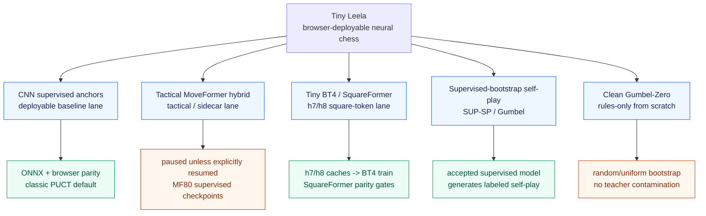

Core separation rule:

- **Supervised / SUP-SP** may use trained models and labeled supervised provenance.
- **Gumbel-Zero** must remain rules-only and random/from-scratch, with separate buffers and manifests.
- **Evaluation/deployment** defaults to classic PUCT unless a protocol card explicitly declares Gumbel or aux/AV search.

## 2. Model architecture breakdowns

### CNN supervised anchors

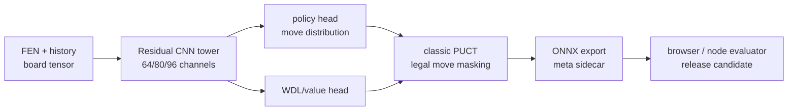

CNN models are the most mature deployment lane: easiest export path, mature ONNX evaluator, browser parity tests, and current best seed for supervised-bootstrap Gumbel self-play.

### Tactical MoveFormer hybrid

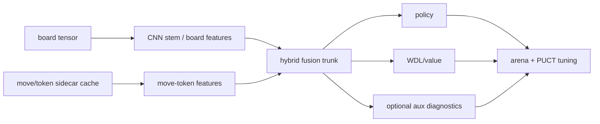

This lane is useful for tactical/move-centric experiments, but is operationally paused unless explicitly resumed. Treat existing MF80 checkpoints as supervised candidates and do not start new Tactical MoveFormer work without approval.

### Tiny BT4 / SquareFormer

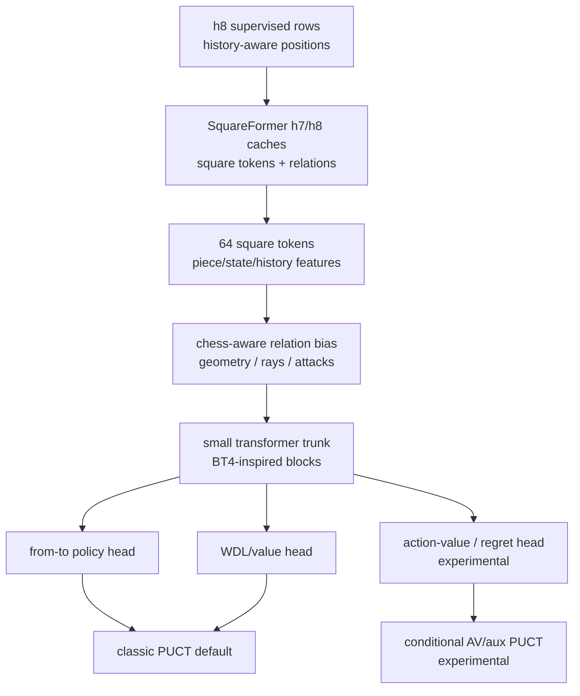

The SquareFormer lane is cache-sensitive: h2 caches are not substitutes for true h7/h8 training. BT4/SquareFormer promotion requires cache manifest validation, model export/parity checks, and eval gates.

## 3. Supervised data and training pipeline

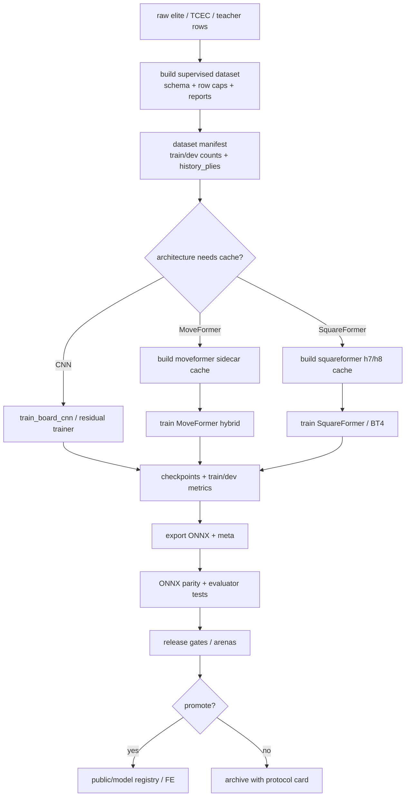

Operational notes:

- Use `.venv-onnx/bin/python` for repo Python tools.
- Do not commit generated outputs under `data/*`, `artifacts/`, `public/models/*.onnx`, `public/models/*.json`, or `dist-client/`.
- Epoch-level checkpoints mean interrupted partial epochs may need to resume from the previous completed epoch.

## 4. AWS data/cache cloud pipeline

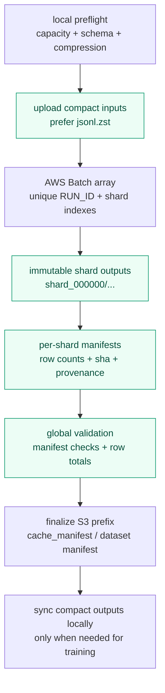

Cloud standards for all large jobs:

- Use compressed shard data by default: `.jsonl.zst` or equivalent.
- Keep outputs under immutable `RUN_ID` prefixes.
- Record `SHARD_INDEX`, seed, source model, model/meta SHA, git/job metadata, and output prefix.
- Do not bake large model artifacts into worker images; fetch by S3 URI and verify SHA256.
- Reuse model S3 artifacts where possible instead of re-uploading the same ONNX every run.
- Sync/download only the outputs needed for validation or training; exclude repeated model files.

## 5. Supervised-bootstrap Gumbel self-play cloud flow

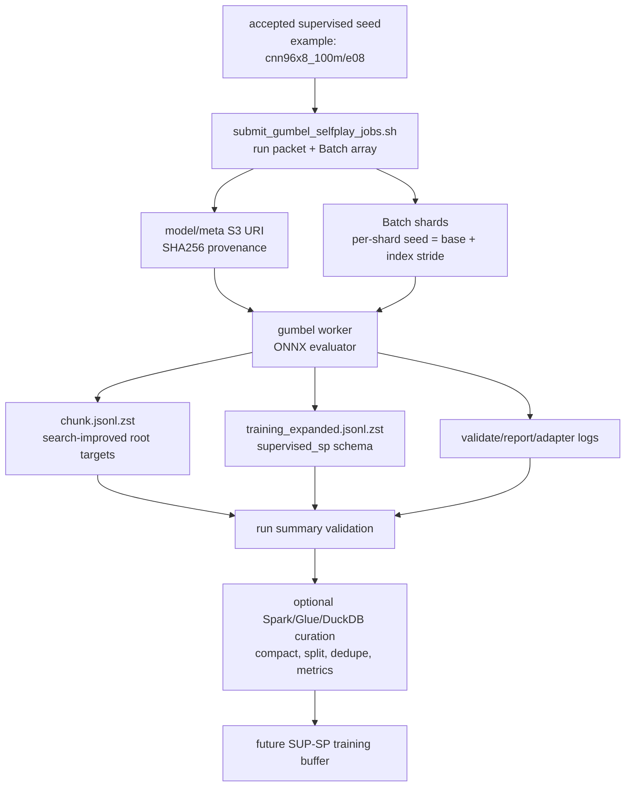

This lane is **not** clean Zero. It is supervised model self-play improvement, so every shard must carry `lane=supervised_sp` and `source_model` provenance.

## 6. Clean Gumbel-Zero loop

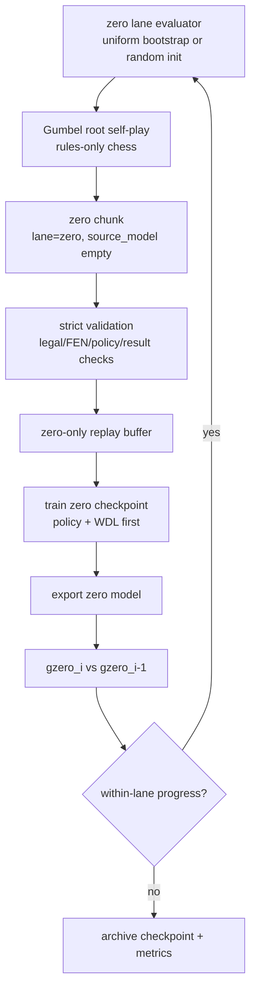

Zero invariants:

- no supervised initialization,
- no teacher labels,
- no supervised replay contamination,
- checkpoint-vs-checkpoint promotion before cross-lane comparisons.

## 7. Evaluation and promotion flow

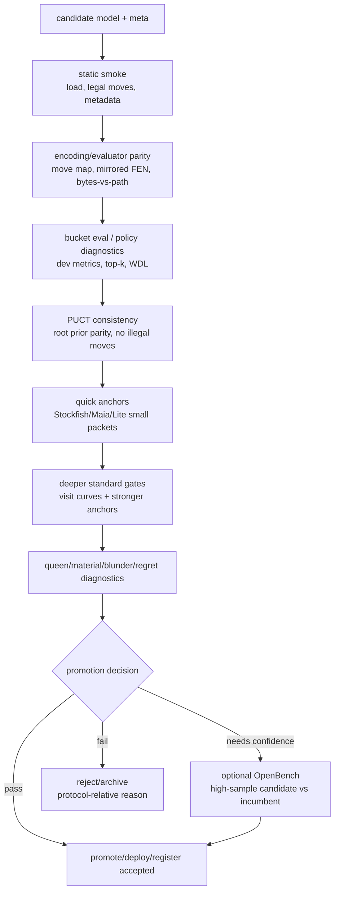

Promotion claims should always include protocol context: model SHA/path, meta, search config, visits, openings, anchors, illegal counts, WDL, backend, and error bars.

## 8. ONNX/browser deployment flow

```mermaid
flowchart LR
  PT["PyTorch checkpoint"] --> Export["export ONNX + meta"]
  Export --> Check["onnx.checker + metadata audit"]
  Check --> Simplify["optional onnxsim deploy sibling"]
  Simplify --> Parity["semantic parity <= tolerance"]
  Parity --> Bench["latency/search benchmark<br/>WASM/native, batch/thread matrix"]
  Bench --> FE["frontend model registry"]
  FE --> Build["npm typecheck + client build"]
  Build --> Release["deployable release artifact"]
```

Quantization belongs in this flow only after FP32 parity and benchmark baselines are known. PTQ should be debugged and benchmarked before revisiting QAT.

## 9. Where Spark-like dataflow fits

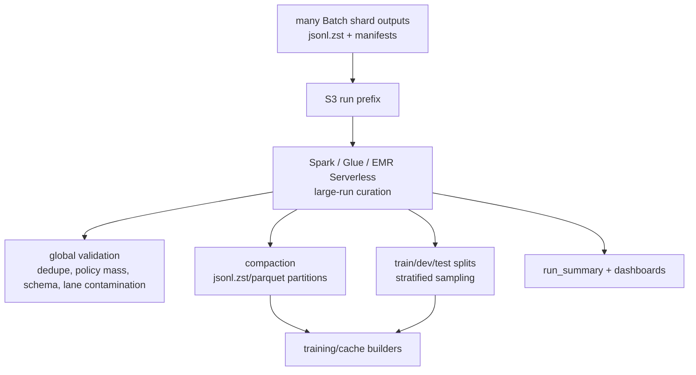

Spark is a good fit for large data curation and validation, not for Gumbel search or model inference itself. For medium runs, DuckDB/Polars may be enough; for hundreds of millions of rows or multi-TB transforms, Spark/Glue/EMR becomes the right janitor layer.

## 10. Documentation backfill checklist

When adding or revising process docs, include:

- one overview diagram,
- exact command entrypoints,
- required inputs and outputs,
- provenance fields and manifests,
- validation gates,
- failure/repair policy,
- lane contamination rules,
- links to current scripts and canonical knowledge notes.

Recommended topic pages to backfill next:

1. `docs/model_architecture_atlas.md` — CNN, MoveFormer, SquareFormer/BT4, heads, encodings.
2. `docs/training_pipeline_atlas.md` — supervised, cache-based, SUP-SP, Zero.
3. `docs/cloud_pipeline_atlas.md` — AWS Batch, S3 layout, compression, Spark curation.
4. `docs/evaluation_promotion_atlas.md` — release gates, anchors, OpenBench, promotion policy.
5. `docs/deployment_runtime_atlas.md` — ONNX export, browser/runtime parity, quantization.
