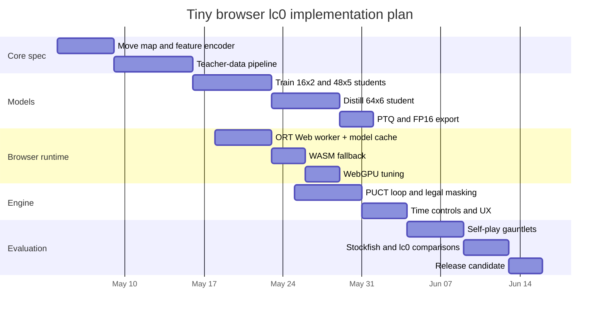

# Building a Tiny In-Browser Leela Chess Zero

## Executive Summary

A browser-suitable “tiny lc0” should not try to be a full port of the modern engine. The practical goal is to borrow the *architecture pattern* that made lc0 successful—policy/value neural evaluation plus PUCT-style Monte Carlo Tree Search—while aggressively simplifying the network, the move encoding, the training pipeline, and the runtime stack. The strongest current lc0 direction has moved beyond the older SE-ResNet design toward transformer-based networks with flexible input formats, but the official project still documents the classic convolutional topology that powered most community experimentation and the small community nets that are easiest to deploy. For a toy browser engine, the right abstraction is therefore “AlphaZero-style search around a tiny distilled network,” not “compile the whole lc0 engine to WebAssembly and hope for the best.” citeturn22view0turn34view0turn23search3turn27view0turn21search0

The most robust product strategy is a two-tier design. First, ship a tiny convolutional student network in the 16x2 to 64x6 family, quantized for CPU/WASM or converted to FP16 for WebGPU, with a lightweight TypeScript or Rust/Wasm PUCT loop. Second, optionally add a stronger browser tier for desktops using WebGPU and, if desired, a server fallback for analysis mode. Existing browser projects already show that lc0-family networks from beginner strength through strong amateur/master-level can be run client-side with ONNX Runtime Web, WebGPU, and WASM fallback. That makes “toy lc0 in browser” a solved packaging problem at small scales; the hard part is choosing the right model and training recipe. citeturn17view0turn10view3turn10view4turn12view1

For compression, the highest-value sequence is: distill from a stronger teacher into a small student; keep the student dense and regular; export to ONNX; then use PTQ or QAT depending the target backend. If the primary target is CPU/WASM, INT8 is the first optimization to try. If the primary target is WebGPU, FP16 or mixed precision is usually a better first target than integer-only inference. Pruning and low-rank factorization are viable, but in browser environments they are most useful when they preserve dense kernels or produce structurally smaller models, because generic browser runtimes do not automatically turn arbitrary sparsity into speed. citeturn7search0turn29view0turn29view1turn29view2turn29view3turn30search1turn31view0

If you want one concrete recommendation: start with a 48x5 or 64x6 SE-style convolutional student, omit the moves-left head in version one, distill from a stronger lc0-family teacher using policy targets from search rather than raw policy logits, add a small WDL head, and run 64 to 128 PUCT playouts per move in-browser. That should fit well within a sub-10 MB deployment envelope after compression, remain understandable to build, and give a qualitatively “Leela-like” experience without requiring AlphaZero-scale infrastructure. The official lc0 network list, community small-net ecosystem, AlphaZero paper, Chessformer paper, and modern browser inference docs together support that choice better than any attempt to port the strongest current lc0 transformer networks directly to the web. citeturn15view0turn17view0turn1view5turn33view0turn10view1turn10view4turn11view3

## lc0 Architecture and Training Pipeline

The original AlphaZero recipe that inspired lc0 is conceptually simple: encode the board state as a stack of planes, predict a policy over moves and a value for the position, and use MCTS with PUCT to turn those predictions into improved move choices and improved training targets. In AlphaZero’s chess configuration, the published network used an initial convolution followed by 19 residual blocks with 256 filters; the policy head used a chess-specific move encoding, the value head returned a scalar in `[-1, 1]`, and the search used 800 simulations per move during training. Training used a joint loss over value error, policy targets from search, and regularization. citeturn33view0turn33view1turn1view5

lc0 still follows that overall decomposition, but the project’s own current documentation makes clear that several details changed over time. The AlphaZero primer states that lc0 is built around the neural net plus MCTS/PUCT loop, that the value head now uses WDL probabilities rather than only a scalar, that lc0 also has a “moves left” head, and that starting from v0.32 the input format became more flexible while the body moved to transformer-based architectures. At the same time, the older but still useful topology page documents the classic convolutional lc0 design: 112 input planes on an 8×8 board, an SE-augmented residual tower, a policy head, a WDL value head, and a moves-left head. Read together, those two official documents imply an important engineering conclusion: if you want “tiny browser lc0,” you are free to target the *classic* topology even though the strongest *current* project direction is transformer-heavy. citeturn22view0turn34view0

The classic convolutional lc0 body is a good toy target because it is regular, dense, small, and operator-friendly for browser runtimes. The older official topology describes an input convolution from 112 planes into `FILTERS`, followed by `BLOCKS` residual blocks, each block containing two 3×3 convolutions and an SE module. The current convolutional policy head maps from `FILTERS` to an 80×8×8 tensor and then gathers a move vector from that tensor. The value head maps to a 128-dimensional hidden state and then to WDL via softmax. The moves-left head is another small auxiliary tower. Typical historical sizes listed by the project include 10×128, 20×256, and 24×320, and the network page also lists very small community nets at 2 blocks × 16 filters, 5 × 48, and 9 × 112. citeturn34view0turn15view0

The modern lc0 direction is different. The official transformer progress post says the strongest lc0 transformer, BT4, used an encoder-only architecture with 64 tokens—one per square—plus chess-specific embeddings that include piece identity over the current and last seven plies, en passant and castling information, rule-50 count, and repetition features. That same post says BT4’s raw policy was about 270 Elo stronger than the strongest convolutional T78 net while using fewer parameters and less computation. The AlphaZero primer likewise says lc0 has switched to transformer-based networks. This matters analytically because it tells you where state-of-the-art lc0 went, but it does **not** mean a transformer is the right first browser target. The strength gain came after significant architecture work and scale, not because “attention is always better at small size.” citeturn10view2turn22view0

The move-output interface is the one place where lc0’s documentation is internally awkward and where a toy implementation should deliberately simplify. The older convolutional topology page documents a gathered policy vector of length 1858, while the newer AlphaZero primer describes the policy as 1862 total move elements and notes that lc0’s input format is evolving. For a toy project, the safe engineering lesson is not to reproduce every historical lc0 encoding choice. Instead, freeze a single legal-move indexing scheme early—either an AlphaZero-style move map or a simpler flat legal-move head used with masking—and keep it identical during training, export, and inference. Exact fidelity to legacy lc0 indexing is not the highest-value use of effort. citeturn34view0turn22view0

lc0’s training pipeline on entity["company","GitHub","GitHub, CA, US"] is also informative for toy work because it shows what the official project considered “normal” for small-to-medium experiments. The `lczero-training` README describes downloading tarred training chunks, configuring training through YAML, and using batch sizes such as 2048 with piecewise learning-rate schedules. The example config uses `policy_loss_weight`, `value_loss_weight`, total steps, shuffle size, and straightforward model width/depth settings. Meanwhile the project-history page records real run settings such as 10×128, 15×192, and 15×512 networks plus learning-rate drops, policy temperature changes, FPU tuning, and KLD settings across runs. That history is useful because it shows that “smallish nets plus relatively ordinary SGD-style schedules” are completely in-family for lc0 experimentation, even if the flagship nets became much larger. citeturn26view0turn25view1

A concise way to frame the architecture choices is this:

| Aspect | AlphaZero baseline | Classic lc0 conv family | Modern lc0 transformer family |
|---|---|---:|---:|
| Board encoding | 119 history planes | 112 planes in older official conv docs | 64 square tokens with chess-specific embeddings |
| Body | 19 residual blocks, 256 filters | SE-ResNet towers with variable width/depth | Encoder-only transformer |
| Heads | Policy + scalar value | Policy + WDL + moves-left | Policy + WDL-style evaluative heads, transformer-specific variants |
| Search | PUCT MCTS | PUCT-family MCTS with lc0 refinements like FPU and unscored virtual visits | Same overall search role |
| Browser suitability | Moderate | Best first target | Possible, but harder |

The AlphaZero row comes from the published chess architecture and training configuration; the classic and modern lc0 rows come from official lc0 docs and posts. citeturn33view0turn22view0turn34view0turn10view2

## Compression Methods for Tiny Chess Nets

Knowledge distillation is the single most important compression tool for a tiny chess net. The original distillation paper argues that a smaller student can learn a richer output distribution from a larger teacher than it can from hard labels alone. In chess, that idea maps especially well because there are at least three useful teacher signals: the raw policy distribution, the *search-improved* policy from MCTS visit counts, and the value/WDL estimate. For a Leela-like engine, the best distillation target is usually the *search policy* rather than the raw teacher policy, because the student then learns not only what the teacher network “thinks,” but what the teacher-plus-search system actually *plays*. That keeps the small model closer to the behavior that matters at inference time. citeturn7search0turn1view5turn22view0

A practical toy-student loss should therefore be more explicit than AlphaZero’s original one. A good browser-oriented student objective is

```text
L = λπ · KL(πteacher_search || πstudent)
  + λwdl · CE(wdlteacher || wdlstudent)
  + λq · MSE(qteacher || qstudent)
  + λreg · ||θ||²
```

and, only if you want lc0-like fidelity, an auxiliary moves-left term. If your student and teacher share intermediate structure—say, both are conv towers—you can also add feature matching or attention-map matching, but that is optional. The main failure mode in tiny students is usually not lack of intermediate supervision; it is a mismatch between the training targets and the deployment regime. Distill from the exact thing you will use: policy-only if you are shipping zero-node play, or search policy if you are shipping PUCT. citeturn7search0turn22view0turn10view0

Searchless supervised distillation is now a serious alternative if you do **not** insist on pure self-play. entity["organization","DeepMind","ai research lab"]’s ChessBench/searchless-chess project reports a 270M-parameter transformer trained on 10 million games and 15 billion value/action annotations produced by Stockfish 16, and the repository explicitly frames this as distilling a search-based algorithm into a pure policy model. That is far beyond toy scale, but it proves an important point: for a small browser engine, a supervised teacher-generated dataset can be much more compute-efficient than trying to recreate AlphaZero-style learning from scratch. If your goal is an educational or deployable toy rather than ideological purity, teacher-generated labels are a rational shortcut. citeturn19search1turn10view0

Pruning is useful, but only when you are honest about the runtime. Han et al.’s classic pruning result shows that large dense networks can often be pruned and then fine-tuned with little accuracy loss. TensorFlow Model Optimization also exposes practical pruning APIs, including structured pruning. For browser deployment, however, the key distinction is between *file compression* and *actual latency*. Unstructured sparsity frequently shrinks the effective parameter set, but browser runtimes and generic WebGPU kernels do not automatically turn arbitrary zero patterns into faster inference. Structured pruning, channel pruning, or “architecture pruning” that reduces layer widths is usually more deployable than a highly sparse unstructured mask. citeturn30search1turn30search2turn30search0

Low-rank factorization is particularly attractive for browser targets because it preserves dense matrix multiplies and dense convolutions. The CVPR 2020 low-rank compression paper emphasizes exactly that point: low-rank forms can be hardware-friendly, especially on GPUs, because they use regular dense matrix operations with good memory-access patterns. For tiny chess nets, low-rank factorization is most attractive in the policy/value heads and in wider later layers of a conv student; it is less attractive when the whole model is already extremely small, because decomposition overhead can erase the win. Use it after distillation, not before. citeturn31view0

Quantization is the main deployment lever after architecture choice. ONNX Runtime’s quantization docs describe 8-bit linear quantization, QOperator/QDQ representations, and both dynamic and static calibration. TensorFlow’s optimization docs likewise recommend 16-bit floats for GPU acceleration and 8-bit integers for CPU execution, with full integer quantization requiring representative calibration data. Jacob et al.’s integer-only inference paper is still the canonical argument for why int8 matters on edge devices: smaller models, less bandwidth, and lower-cost arithmetic. For a tiny chess model, that translates directly into faster downloads, better cache locality, and more positions per second. citeturn29view0turn29view2turn7search1

The deployment rule of thumb is straightforward:

| Method | What it buys you | Best fit for tiny chess nets | Browser fit |
|---|---|---|---|
| Distillation | Largest strength-per-parameter gain | Essential | Excellent |
| Width/depth reduction | Smallest engineering risk | Essential | Excellent |
| INT8 PTQ | 4× smaller weights, better CPU efficiency | First try for WASM/CPU | Strong |
| INT8 QAT | Better accuracy than PTQ at low precision | Use if PTQ hurts tactics badly | Strong but more work |
| FP16 / mixed precision | ~2× smaller weights, often faster on GPU | First try for WebGPU | Strong |
| Structured pruning | Smaller dense model, possible speedup | Good after distillation | Fair to good |
| Unstructured pruning | Potential storage win | Secondary | Usually weak for latency |
| Low-rank factorization | Dense compute with smaller matrices | Good for wider students | Good if kernels stay dense |

This table is a synthesis from the distillation, pruning, quantization, and mixed-precision sources rather than a single paper. citeturn7search0turn29view0turn29view1turn29view2turn29view3turn30search1turn31view0

## Lightweight Architecture Choices

For a browser toy, convolution is still the default recommendation. The official lc0 transformer post shows why transformers won at the high end: long-range interactions matter in chess, and lc0’s BT4 overtook the best convolutional net in raw policy strength. The Chessformer paper reaches a similar conclusion from another direction, reporting a 6M-parameter CF-6M model and much larger transformer models, while arguing that the right position representation matters as much as scale. But both sources also point to a practical constraint: those wins arrived with carefully engineered token embeddings, relative position schemes, and substantial datasets. Tiny browser projects do not automatically inherit that payoff. citeturn10view2turn10view1turn32view0turn32view2

Convolutional students have three decisive advantages for a first browser engine. They align well with the board’s local geometry; they are easier to export and run across ONNX Runtime Web, TensorFlow.js, or even custom Wasm kernels; and their parameter counts scale gently with filter width and block count. MobileNet and EfficientFormer are useful “efficiency literature” reminders here: the best small models are not merely smaller, they are designed around cheap operators and latency-aware structure. That principle carries over to chess. A 48x5 or 64x6 residual-SE student is not state of the art, but it sits on a very favorable latency-strength curve for web deployment. citeturn8search2turn8search15turn17view0

The community nets already deployed in-browser are especially valuable because they give real, not hypothetical, anchor points. The `play-lc0` project lists beginner nets like Tiny Gyal (16x2, roughly 800–1000 depth-0 Elo), mid-tier small nets like Good Gyal 5 (48x5, roughly 1800–1900), Bad Gyal 3 (64x6, roughly 1900–2050), and larger distilled 112x9/128x10 families in the 2250+ depth-0 range. Those numbers are approximate and the project explicitly labels them as “0-node Elo,” but that is exactly why they are useful for browser design: they isolate raw network strength before search. They show that very small conv nets can already be fun, useful, and browser-appropriate. citeturn17view0

The official lc0 network list complements that picture from the project side. It lists current transformer networks at 1024×15 and 768×15, medium transformer nets at 512×15, and a small transformer at 256×10 with a 30–40 MB file size. It also explicitly lists “very small” human-sparring nets under roughly 128 filters and 10 blocks and points to 2×16, 5×48, and 9×112 community nets. That is strong evidence that the lc0 ecosystem itself treats small conv nets as a legitimate family for human play and experimentation, even if they are not the flagship competition models anymore. citeturn15view0

A practical candidate table looks like this:

| Candidate | Approx architecture | Approx parameter class | Approx deployed size | Observed raw strength class | Recommendation |
|---|---|---:|---:|---:|---|
| Micro CNN | 16x2 SE-ResNet | ~0.3M params | `<1 MB` after int8 or compact ONNX | ~800–1000 depth-0 Elo | Best for instant load, educational demos |
| Small CNN | 48x5 SE-ResNet | ~0.6M params | ~2 MB fp32 ONNX, smaller with FP16/INT8 | ~1800–1900 depth-0 Elo | Best balance for “fun engine” |
| Practical CNN | 64x6 SE-ResNet | ~0.9M params | ~3 MB fp32 ONNX, smaller with FP16/INT8 | ~1900–2050 depth-0 Elo | Best first serious browser target |
| Strong small CNN | 112x9 distilled SE | ~2.7M params | ~10–16 MB depending format | ~2250–2350 depth-0 Elo | Good desktop-tier target under 10 MB only with compression |
| Tiny transformer | 1–3M-class encoder-only | varies | likely 4–12 MB depending export | unclear without significant tuning | Only if your goal is architecture research |
| Small transformer | CF-6M-like | 6M params | too large for a “tiny” first target | materially stronger potential | Research target, not first product |

The conv parameter classes are estimated from the official older lc0 topology; the observed strength classes and several observed download sizes come from the browser `play-lc0` project; the transformer reference point comes from the 6M-parameter Chessformer paper. citeturn34view0turn17view0turn10view1turn32view2

My design recommendation is to use **three explicit deployment targets**:

| Target | Recommended model | Model budget | Runtime target | Expected user experience |
|---|---|---:|---:|---|
| Instant | 16x2 or 24x3 conv, policy+WDL only | `<1 MB` | WASM SIMD everywhere | very fast, casual, mobile-safe |
| Balanced | 48x5 or 64x6 conv, policy+WDL | `<10 MB` | WASM SIMD + WebGPU acceleration | strong club-level play, practical |
| Desktop analysis | compressed 112x9 conv or 1–3M transformer | `<10–20 MB` | WebGPU preferred | noticeably stronger, slower load |

These are deployment recommendations, not published benchmark tiers. They are the most defensible synthesis of the lc0 small-net ecosystem and current browser inference stacks. citeturn15view0turn17view0turn10view4turn12view1

## Training Data and Self-Play Strategy

The most important scoping decision is whether your toy engine is **pure self-play RL** or **teacher-bootstrapped**. If it is pure self-play in the AlphaZero sense, the literature makes clear how far the gap is between “toy” and “state of the art.” AlphaZero used 5,000 first-generation TPUs for self-play generation and a TPU pod for training, and the strongest recent non-lc0 transformer work used tens of millions to hundreds of millions of games. Even the smaller CF-6M Chessformer variant trained on 53 million games. That is not a realistic baseline for an indie browser toy. citeturn33view2turn32view2turn32view4

The official lc0 training repository suggests a more practical scale for experimentation: train on downloaded chunked data, use straightforward YAML configs, and batch sizes around 2048 with piecewise learning-rate schedules. The example config is not a claim that 100,000 chunks are “small,” but it is a useful signal that the lc0 codebase itself was built for iterative, scriptable, configurable training rather than one giant monolithic RL procedure. For a toy project, that points to a staged curriculum: supervised warm-start, then tiny self-play fine-tuning if desired. citeturn26view0

My recommended data curriculum is as follows. Start with **teacher-generated supervised data** from either a small lc0 teacher, a standard desktop lc0 net, or a strong classical engine if you accept that your toy will be “Leela-like” rather than philosophically identical to lc0. Generate 1 million to 5 million positions, with legal-move masks, teacher policy targets, and WDL/Q targets. Use that to train the student to convergence. Only *after* that, run constrained self-play using your browser-target model with 64 to 256 playouts and periodically distill the resulting search policy back into the same student. This dramatically reduces the search cost of the training loop. That recommendation is a direct consequence of the official AlphaZero and searchless/ChessBench results: when compute is scarce, move the expensive search into an offline teacher phase. citeturn1view5turn19search1turn10view0

For augmentation, keep it conservative. Side-to-move canonicalization is essentially mandatory. Horizontal mirroring can help if your move encoding mirrors exactly with the board and you handle castling and en passant consistently. I would **not** build the first training pipeline around complex symmetry schemes or transposition deduplication unless the rest of the stack is already stable. Browser projects fail more often from encoding mismatches than from lack of augmentation. This is an engineering recommendation rather than a literature claim.

The hyperparameters should be modest and boring. A warm-start student can use AdamW or Nadam, batch sizes in the 512 to 2048 range, gradient clipping, and a 2- or 3-stage learning-rate schedule. That is consistent with both the lc0 training config examples and the Chessformer training configs, even though the exact values differ. If you stay under about one million parameters, a single modern consumer GPU should be enough for a serious prototype; if you insist on pure self-play, the compute requirements rise by an order of magnitude or more because search, not SGD, becomes the dominant cost. citeturn26view0turn32view0turn32view2

A pragmatic first training setup would be:

| Stage | Data | Budget | Goal |
|---|---|---:|---|
| Warm start | 1–5M teacher-labeled positions | 1–3 days on one good GPU | stable policy/value student |
| Compression pass | PTQ first, then optional QAT | hours to 1 day | reduce size without tactical collapse |
| RL fine-tune | 0.5–2M self-play positions with low playouts | several GPU-days or CPU cluster days | “Leela-like” playstyle and calibration |
| Evaluation cycle | self-play + head-to-head gauntlets | continuous | pick the deployable checkpoint |

That table is a recommended project plan, not an official lc0 recipe; it is intentionally much smaller than AlphaZero or modern chess-transformer pipelines.

If you want a lc0-flavored starting config, the official training repo gives this pattern: a YAML config with model width/depth, `batch_size`, `total_steps`, a staged LR schedule, and separate policy/value weights, then training through `train.py`. citeturn26view0

```yaml
name: "tiny-browser-student"
dataset:
  input_train: "/data/train/*"
  input_test: "/data/test/*"
training:
  batch_size: 1024
  total_steps: 150000
  test_steps: 2000
  shuffle_size: 262144
  lr_values: [0.002, 0.0002, 0.00005]
  lr_boundaries: [100000, 135000]
  policy_loss_weight: 1.0
  value_loss_weight: 1.0
  path: "./checkpoints"
model:
  filters: 64
  residual_blocks: 6
```

The official lc0 training command is similarly simple: citeturn26view0

```bash
./train.py --cfg configs/example.yaml --output /tmp/mymodel.txt
```

## Browser Inference and Deployment

For web deployment, the center of gravity has moved away from older libraries toward ONNX Runtime Web. entity["company","Microsoft","software company"]’s official ONNX Runtime Web docs describe in-browser inference with WebAssembly, WebGPU, and WebNN execution providers, and explicitly note that WASM supports all ONNX operators while WebGL, WebGPU, and WebNN support only subsets. They also describe ORT-format optimization, WebGPU graph capture, and the standard JavaScript import path. In contrast, the official ONNX.js repository is now archived and explicitly says it has been replaced by ONNX Runtime Web. For a new project in 2026, ONNX Runtime Web should be the default unless you have a strong reason to build custom kernels. citeturn10view3turn10view4turn14view0

WebGPU is the highest-upside browser backend when the model is more than trivially small. The official ONNX Runtime WebGPU docs say it is the preferred path for more compute-intensive models; the Chrome/WebGPU overview says WebGPU can bring more than 3× improvements in ML inference relative to WebGL; and the ONNX Runtime WebGPU launch post highlights FP16 support, IO binding, and large acceleration on vision workloads. The caveat is compatibility and operator coverage: MDN still labels WebGPU as limited availability, and ONNX Runtime’s own docs say GPU backends support only subsets of operators. For a toy chess net composed of convs, matmuls, activations, and small heads, that limitation is usually manageable. citeturn10view4turn12view0turn12view1turn11view1

WebAssembly remains the universal fallback and should probably be your *default* baseline target. The official Emscripten docs say `-msimd128` enables Wasm SIMD and note broad browser support; TensorFlow.js’ WASM backend documentation explains that SIMD and multithreading can significantly accelerate CPU inference, while also noting that multithreading requires cross-origin isolation. For tiny conv students, WASM SIMD is often enough by itself; for stronger small models, it provides a reliable fallback when WebGPU is unavailable or flaky. citeturn11view3turn11view4turn11view5turn11view2

WebNN is promising but not yet a safe first dependency. The W3C spec frames it as a hardware-agnostic abstraction over OS-level ML accelerators, and ONNX Runtime Web supports a WebNN execution provider with device preferences for CPU, GPU, or NPU. But the official Microsoft Learn overview says GPU and NPU support are still preview and that WebNN should not currently be used in production, while the ONNX Runtime docs say current browser support is behind flags in the latest Chrome and Edge builds. In other words: support it opportunistically, but do not build your first product plan around it. citeturn10view5turn14view1turn11view0

TensorFlow.js is still a valid choice if your training pipeline already lives in TensorFlow and you are willing to export into the TF.js ecosystem. Its WASM backend is mature and benefits from SIMD and XNNPACK acceleration, and the platform/environment docs remain useful. But for chess nets specifically, ONNX Runtime Web has two advantages: the lc0 ecosystem already has an official `leela2onnx` conversion path, and ONNX Runtime Web cleanly spans WASM, WebGPU, and WebNN from one model format. That reduces the translation burden. citeturn11view5turn13search13turn20search5

The runtime choice matrix is therefore:

| Stack | Best use case | Main strengths | Main weaknesses |
|---|---|---|---|
| ONNX Runtime Web + WASM | universal baseline | widest compatibility, full op coverage | CPU-bound |
| ONNX Runtime Web + WebGPU | desktop and stronger models | best browser acceleration, FP16, graph capture | operator subset, browser variability |
| ONNX Runtime Web + WebNN | future native/NPU path | direct access to OS ML acceleration | still preview / behind flags |
| TensorFlow.js + WASM | TF-native projects, small CPU models | mature CPU backend, XNNPACK | another model format and toolchain |
| Custom Wasm via Emscripten | maximal control, tiny custom kernels | smallest runtime, hand-tuned code paths | highest engineering cost |
| Full lc0 compiled for web | research curiosity | code reuse in theory | not an official target, too heavy for a first build |

This table synthesizes official ONNX Runtime, WebGPU, WebNN, TensorFlow.js, Emscripten, and lc0 project documentation. citeturn10view3turn10view4turn14view1turn11view0turn11view4turn11view3turn21search0

The official lc0 codebase also gives you the important export bridge: `main.cc` registers a `leela2onnx` mode, and browser projects such as `play-lc0` use exactly that export route before loading the resulting model with `onnxruntime-web`. This is the cleanest sanctioned path from lc0-family weights to the browser. citeturn20search5turn17view0

```bash
lc0 leela2onnx --input=weights.pb.gz --output=model.onnx
```

Once you have ONNX, the official WebGPU provider usage is minimal: citeturn10view4

```javascript
import * as ort from 'onnxruntime-web/webgpu';

const session = await ort.InferenceSession.create('/models/tiny.onnx', {
  executionProviders: ['webgpu'],
});
```

And if you want a generic custom C++ helper module—say, for move generation, feature encoding, or a tiny handcrafted fallback net—Emscripten’s SIMD docs support the standard `-msimd128` path. A minimal pattern looks like this: citeturn11view3turn11view2

```bash
emcc encoder.cpp -O3 -msimd128 \
  -sMODULARIZE -sEXPORT_ES6 \
  -sENVIRONMENT=web \
  -o encoder.js
```

For post-training optimization, ONNX Runtime’s Python APIs cover dynamic/static quantization, and its mixed-precision docs cover FP16 conversion. Both are directly relevant to the browser. citeturn29view0turn29view1

```python
from onnxruntime.quantization import quantize_dynamic, QuantType
quantize_dynamic("model.onnx", "model.int8.onnx", weight_type=QuantType.QInt8)
```

```python
import onnx
from onnxconverter_common import float16

model = onnx.load("model.onnx")
model_fp16 = float16.convert_float_to_float16(model)
onnx.save(model_fp16, "model_fp16.onnx")
```

### Reference Projects and Concrete Benchmarks

The most directly relevant browser example is `play-lc0`, an independent project that runs lc0-ecosystem networks entirely client-side through ONNX Runtime Web, using WebGPU with WASM fallback. Its README is unusually useful because it lists network families, approximate depth-0 Elo ranges, observed ONNX download sizes, model caching, and the exact `lc0 leela2onnx` conversion flow. For your problem statement, this project is arguably the best proof that “tiny browser Leela” is practical. citeturn17view0

The second important reference is Maia. The original Maia paper and current repositories matter because they show a different but highly relevant design point: AlphaZero-style small nets trained to model human play rather than purely maximize strength. For a browser toy meant to feel engaging rather than to maximize engine rating, this is a useful reference family, especially because Maia-class nets are much smaller than state-of-the-art lc0 transformers and are already deployed in web experiences. citeturn18search5turn18search0turn18search12

The third reference is searchless ChessBench/searchless-chess from entity["organization","DeepMind","ai research lab"]. It is not a tiny deployment reference, but it is the best modern source for the proposition that search-heavy chess strength can be distilled into pure neural inference when the teacher data are rich enough. That makes it especially valuable for the **training** side of your toy project, even if you never ship a searchless model. citeturn19search1turn10view0

Finally, for packaging patterns rather than architecture, the Lichess `stockfish-web` and older `stockfish.wasm` repositories remain useful browser baselines. They show how a strong chess engine can be packaged into WebAssembly workers and integrated into a production web application. They are not lc0-like, but they are still worth reading if you need worker orchestration, time management, UI separation, or fallback patterns. citeturn18search10turn18search2

## Minimal Implementation Plan and Evaluation

The smallest viable successful project is **not** “port lc0.” It is:

1. implement move generation and search in TypeScript or Rust/Wasm,
2. train or distill a tiny dense conv student offline,
3. export to ONNX,
4. run inference in-browser with ONNX Runtime Web,
5. use a small PUCT loop around the student,
6. treat stronger backends, server assistance, or bigger models as later phases.

That decomposition follows directly from lc0’s own high-level architecture, its sanctioned ONNX export path, and the current browser inference stacks. citeturn27view0turn20search5turn10view3turn10view4

A sensible step-by-step plan is:

| Phase | Deliverable | Estimated effort | Notes |
|---|---|---:|---|
| Spec freeze | board encoding, move index, policy head shape | 2–4 days | hardest source of silent bugs |
| Teacher data generation | 1–5M labeled positions | 3–10 days | offline, can parallelize |
| Baseline student training | 48x5 or 64x6 conv student | 3–7 days | supervised first |
| Compression | INT8 PTQ and FP16 export tests | 1–3 days | keep both CPU and GPU artifacts |
| Browser inference | ORT Web worker + cache + fallback | 3–7 days | WebGPU first, WASM fallback |
| Search | 64–128 playout PUCT + legal masking | 3–7 days | search budget should be configurable |
| Evaluation | gauntlets, Elo estimates, UX polish | 1–2 weeks | tune load time and move latency |

Those durations are planning estimates, not official project benchmarks.

A concrete roadmap for the first two deployment targets is:

| Version | Scope | Model | Search | Size target |
|---|---|---|---|---:|
| v1 | educational browser demo | 16x2 or 24x3 conv | 16–32 playouts | `<1 MB` |
| v2 | genuinely playable toy engine | 48x5 or 64x6 conv | 64–128 playouts | `<10 MB` |
| v3 | desktop-tier browser engine | compressed 112x9 conv or small transformer | 128–256 playouts | `~10–20 MB` |

The evaluation methodology should separate **network quality** from **engine quality**. First, measure pure network metrics: policy top-1/top-k accuracy on held-out teacher labels, WDL calibration, value MSE or Brier score, and node-free move quality on tactical/puzzle suites. Second, measure playing strength: depth-0 policy only, then 1-ply value-only, then PUCT with fixed playout budgets such as 32, 64, and 128. Third, run head-to-head matches against previous checkpoints, a browser-wrapped Stockfish baseline, and at least one standard desktop lc0 network for ceiling reference. Use enough games to compute rating intervals with Ordo or a Bradley–Terry model, and track not only Elo but also latency, memory, and download size. The lc0 wiki itself references Ordo in its testing ecosystem, while browser engine repos provide the practical baseline opponents. citeturn25view0turn17view0turn18search10turn15view0

The implementation timeline, starting from the current week, can be expressed as this illustrative Mermaid Gantt:



The “novel lightweight” ideas most worth actually trying are not exotic architecture tricks; they are deployment tricks that reduce user-visible cost:

- **Progressive loading**: ship a tiny `<1 MB` starter model first, then upgrade to a stronger model in the background when the browser, connection, and battery state allow it.
- **Model surgery**: keep one common trunk and multiple lightweight heads or multiple policy temperatures, instead of shipping fully separate models.
- **Opening-book distillation**: replace the first several plies with a tiny distilled lookup table or compressed opening policy book, then hand off to the neural searcher.
- **Hybrid NN + tiny endgame perfectors**: ship a very small exact table for only the tiniest endgames or a king-and-pawn specialist, not full Syzygy.
- **Server-assisted fallback**: if WebGPU is absent, keep the browser search loop local but allow an optional remote “teacher query” mode for analysis or harder difficulty.
- **Search-budget adaptation**: scale playouts by device capability, browser thread availability, and the current move’s tactical uncertainty instead of fixing one global number.

These are design recommendations, but each follows naturally from the official lc0 modular split between search and neural evaluation plus the realities of browser ML runtimes. citeturn27view0turn10view3turn10view4turn11view3

If you only prioritize a handful of tools and sources, I would do them in this order:

| Priority | Tool or source | Why it matters most |
|---|---|---|
| Highest | lc0 repo and AlphaZero primer | engine/search structure and current project direction |
| Highest | lc0 topology page | small conv-family implementation details |
| Highest | lc0 network list | realistic size envelopes and current net families |
| Highest | lczero-training repo | practical training config structure |
| Highest | AlphaZero paper | canonical policy/value/search training loop |
| High | Transformer Progress and Chessformer | what modern chess transformers changed |
| High | ONNX Runtime Web docs | single best browser inference stack |
| High | WebGPU/WebNN docs from entity["organization","W3C","web standards consortium"] and docs summarized by entity["organization","Mozilla","browser maker"] | compatibility and backend constraints |
| High | PTQ/QAT docs and Jacob 2018 | deployment compression |
| High | play-lc0, Maia, searchless-chess, stockfish-web | concrete examples, browser packaging, and comparison baselines |

The source ordering above is itself a recommendation, but each row is backed by the corresponding primary or official reference. citeturn21search0turn22view0turn34view0turn15view0turn26view0turn33view0turn10view2turn10view1turn10view3turn10view4turn10view5turn11view1turn29view0turn7search1turn17view0turn18search0turn10view0turn18search10

### Open Questions and Limitations

The main unresolved question is not theoretical; it is product-facing: do you want a toy engine that is *Leela-like in method* or *Leela-like in style*? A pure self-play browser student is closer to the former, while a teacher-distilled student—especially from search-generated labels—is much easier to build and likely stronger per byte. The official sources strongly support both interpretations, but they lead to different engineering choices. citeturn1view5turn19search1turn10view0

The second limitation is that browser-specific chess-net latency benchmarks remain much scarcer than generic ML backend benchmarks. The deployment recommendations here are therefore highest confidence on architecture, toolchain, and compression strategy, and lower confidence on exact milliseconds-per-move for any given device class. Wherever I gave size/strength/runtime tradeoff guidance, treat the architecture and size guidance as firmer than the exact latency expectation.